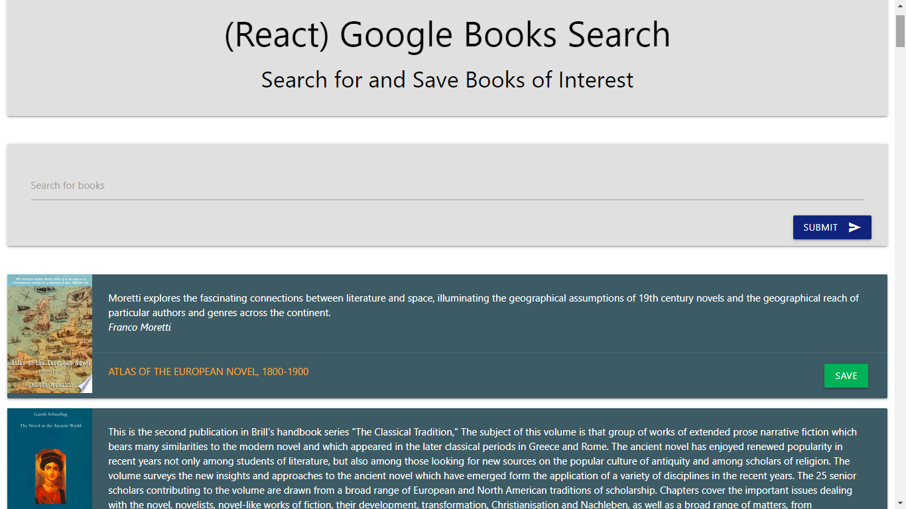

# Google Books Search

### Technologies
Node, Express, React, MongoDB. It follows a MVC design pattern; Node and MongoDB to query and route data in the app, and React to generate the HTML.

NPM packages used:
   1. express

   2. react

   3. mongoose

   4. react-materialize

   5. react-router-dom

   6. axios

CSS Framework - React Materialize   

### Description
React-based Google Books Search app

* Link: 
     * Site Link: https://infinite-escarpment-63304.herokuapp.com/
     * Github Link: https://github.com/shruti-gaonkar/google-books-search

      

* The application displays books based on user searches and allows users to save books to review or purchase later. By default the app displays novels and the search is limited to 40 records.

* This application shows :

  * Search - User can search for books via the Google Books API and render them here. User has the option to view a book by clicking on the title, bringing them to the book on Google Books, or "Save" a book, saving it to the Mongo database.

  * Saved - Renders all books saved to the Mongo database. User has an option to view the book by clicking on the title, bringing them to the book on Google Books, or "Delete" a book, removing it from the Mongo database. 

* The book shows each of the following fields:

* `title` - Title of the book from the Google Books API

* `authors` - The books's author(s) as returned from the Google Books API

* `description` - The book's description as returned from the Google Books API

* `image` - The Book's thumbnail image as returned from the Google Books API

* `link` - The Book's information link as returned from the Google Books API
